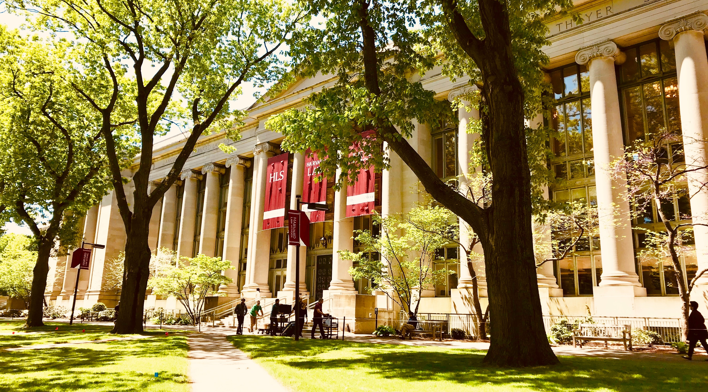

Course Content for ID529 Data Management and Analytic Workflows in R

================

What follows are the time-tables and resources for each course day in
ID529, a 2-week short-course being offered in January 2023.

The website for the course is online at <https://id529.github.io/>.

## Monday January 9th

- 1:30-1:40 Welcome to ID529
- 1:40-2:10 Introductory Lecture: Course Details
- 2:10-2:40 Live Demonstration: Modern Data Science Practices in an R
  Project Based Workflow
- 2:40-2:55 Activity: Q&A + Group reflection on principles shown in the
  demonstration
- 2:55-3:10 Lecture: Introduce the Final Presentations Format
- 3:10-3:15 Break
- 3:15-3:50: Intro to RStudio and R
- 3:50-4:05: Discussion and Self-Introductions
- 4:05-4:45: Lecture: Intro to Git and GitHub
- 4:45-5:00: Demo of how to do the homework
- 5:00-5:05: Positive Affirmations
- 5:05-5:30 Activity: Setup GitHub accounts + work on the homework +
  chat with classmates

Recommended materials:

- Articles:
  - The *Introduction* Chapter to R for Data Science:
    <https://r4ds.had.co.nz/explore-intro.html> (just one page)
  - *Excuse me, do you have a moment to talk about version control?* by
    Jennifer Bryan: <https://peerj.com/preprints/3159.pdf>
  - Tutorial: Getting Started with R and RStudio:
    <https://www.dataquest.io/blog/tutorial-getting-started-with-r-and-rstudio/>
  - Quickstart from GitHub:
    <https://docs.github.com/en/get-started/quickstart/hello-world>
- Videos:
  - RStudio for the Total Beginner, HRAnalytics101:
    <https://www.youtube.com/watch?v=FIrsOBy5k58>
  - If you haven’t already installed R and RStudio, you’ll want to do
    that, and you can do that by following the instructions here:
    - Install R: <https://vimeo.com/203516510>
    - Install RStudio: <https://vimeo.com/203516968>

Homework:

- Write a bio for yourself and include a picture!
- Complete the intro to course survey
- Check that your R and RStudio installations are working on your
  computer

## Tuesday January 10th

- 1:30-2:00 Lecture: Intro to R Programming (including conditionals,
  control flow, etc.)
- 2:00-2:15 Activity: learnr Tutorial on Conditionals and Control Flow
- 2:15-2:45 Lecture: Data Dictionaries and Documentation
- 2:45-3:00 Activity: Q&A + Discussion
- 3:00-3:05 Break
- 3:05-3:35 Lecture: Reading in data of various formats
- 3:35-4:30 Lecture: Intro to ggplot2 (common types of figures,
  faceting, legends, patchwork, and saving figures)
- 4:30-4:50 Discussion: What are the ingredients to a ggplot? What makes
  an effective data visualization?
- 4:50-5:10 Demonstration of how to do the homework
- 5:10-5:30 Time to work on homework, chat with classmates, peruse
  recommended materials, engage in self-affirmation

Recommended materials:

- Our learnr tutorial on Conditionals, Control Flow, and Logic in R
- *Smithsonian Data Management and Best Practices — Describing Your
  Data: Data Dictionaries*
  - <https://library.si.edu/sites/default/files/tutorial/pdf/datadictionaries20180226.pdf>
- *U.S. Geological Survey, Data Dictionaries*
  - <https://www.usgs.gov/data-management/data-dictionaries>
- Skim the readr cheatsheet:
  - <https://raw.githubusercontent.com/rstudio/cheatsheets/main/data-import.pdf>
  - Keep in mind, your goal shouldn’t be to memorize everything, but
    rather to get a sense of what functionality is available to you, and
    how you could reference this cheatsheet or follow up on its contents
    to make use of it.
- Fundamentals of Data Visualization, Chapter 2, *Visualizing data:
  Mapping data onto aesthetics*:
  - <https://clauswilke.com/dataviz/aesthetic-mapping.html>
- Fundamentals of Data Visualization, Chapter 17, *The principle of
  proportional ink*:
  - <https://clauswilke.com/dataviz/proportional-ink.html>
- \[Video\] Introduction to ggplot2
  <https://www.youtube.com/watch?v=UiuA5sBEcFk>
- \[Video\] BeginneR Workshop
  <https://www.youtube.com/watch?v=7kuPnVZcot0> \[lecture starts around
  20:00\]
  - Check the video description for the code files
- \[Video\] Intro to Git and GitHub
  <https://www.youtube.com/watch?v=u4LIpYC0Yaw>

Truly extra reading for those interested in advancing their conceptual
understanding of ggplot2 and the possibilities in data visualization:

- *A Layered Grammar of Graphics, by Hadley Wickham*
  <http://vita.had.co.nz/papers/layered-grammar.pdf>
- Start to get familiar with the ggplot2 book. We recommend starting
  with subsection 1.2 “What is the grammar of graphics?” here:
  <https://ggplot2-book.org/introduction.html#what-is-the-grammar-of-graphics>
- The R Graph Gallery: <https://r-graph-gallery.com/index.html>

Homework:

- Read in a dataset of your choice \[we will give you some example
  datasets you can use\] and create a figure using ggplot2. We want to
  see students include titles, subtitles, captions, data sources,
  legends, etc.

What you can expect from the instructional team:

- We will be reading your bios and working on sorting you into groups
  for the final presentation topics.

## Wednesday January 11th

- 1:30-2:00 Lecture: R Projects
- 2:00-2:50 Lecture: Intro to dplyr
- 2:50-3:10 Activity: Work on dplyr learnr tutorial in groups
- 3:10-3:15 Break
- 3:15-3:35 Lecture: Cleaning Text Data
- 3:35-4:05 Lecture: Writing Functions
- 4:05-4:30 Activity: Write functions together
- 4:30-4:45 Activity: Discussion Q&A from ggplot2 Homework
- 4:45-4:55 Survey: Checking in on Pacing
- 4:55-5:10 Demonstration of how to do the homework
- 5:10-5:30 Time to work on homework, chat with classmates, peruse
  recommended materials

Recommended reading:

- On Projects:
  - Tidyverse Blog, Project-Oriented Workflow by Jenny Bryan:
    <https://www.tidyverse.org/blog/2017/12/workflow-vs-script/>
  - R for Data Science, Chapter 8:
    <https://r4ds.had.co.nz/workflow-projects.html>
  - Project-Oriented Workflow, Jenny Bryan
    <https://www.tidyverse.org/blog/2017/12/workflow-vs-script/>
- On dplyr, cleaning text, and writing functions
  - R for Data Science, Chapter 5 Data Transformation:
    <https://r4ds.had.co.nz/transform.html>
  - R for Data Science, Chapter 14 Strings:
    <https://r4ds.had.co.nz/strings.html>
  - R for Data Science, Chapter 19 Functions:
    <https://r4ds.had.co.nz/functions.html>

Homework:

- No homework

## Thursday January 12th

- 1:30-2:00 Lecture: Diverse Data Sources (APIs \[tidycensus, WHO, World
  Bank, qualtRics\], scraping web data, tabulizer, tesseract, datapasta)
- 2:00-2:20 Discussion: What kind of sources are students interested in
  using in their research or future work?
- 2:20-2:50 Lecture: How to handle factors and date-times
- 2:50-3:00 Break
- 3:00-3:30 Lecture: Regression Modeling: How to fit regression models,
  extracting model summaries from fit model objects, visualizing model
  estimates
- 3:30-4:15 Activity: Working with Regression Models in R
- 4:15-4:45 Lecture: Creating maps in R
- 4:45-5:00 Lecture: Reproducible Examples for Getting Help
- 5:00-5:30 Time to work on final presentation materials together,
  peruse recommended materials, chat with classmates

Homework 4:

- Choose one of the prespecified geospatial datasets and create a map in
  R
- Fit and report on a regression model including categorical (factor)
  variables
- Peer Review for Homework 3

Available/Recommended Reading (Remember! You don’t have to read all of
this! Just focus on what’s most useful to you):

- Tidy Data by Hadley Wickham
  <https://vita.had.co.nz/papers/tidy-data.pdf>
- Diverse Data Sources
  - The readme to the datapasta package:
    <https://github.com/MilesMcBain/datapasta>
  - *Analyzing US Census Data by Kyle Walker*, Chapter 2: An
    introduction to tidycensus:
    <https://walker-data.com/census-r/an-introduction-to-tidycensus.html>
  - The `readr` cheatsheet:
    <https://raw.githubusercontent.com/rstudio/cheatsheets/main/data-import.pdf>
  - *Working with Qualtrics Data - Part 1: Importing Data, ROpenSci*
    <https://ropensci.org/blog/2022/08/02/working-with-qualtrics-data-importing/>
- Handling factors and date-times in R:
  - *Chapter 15: Factors, R for Data Science by Hadley Wickham and
    Garrett Grolemund* <https://r4ds.had.co.nz/factors.html>
  - *Chapter 16: Dates and Times, R for Data Science by Hadley Wickham
    and Garrett Grolemund* <https://r4ds.had.co.nz/dates-and-times.html>
  - *Forcats cheatsheet*
    <https://raw.githubusercontent.com/rstudio/cheatsheets/main/factors.pdf>
  - *Lubridate cheatsheet*
    <https://raw.githubusercontent.com/rstudio/cheatsheets/main/lubridate.pdf>
- Working with Regression Models:
  - *Introduction to `broom`*
    <https://broom.tidymodels.org/articles/broom.html>
  - sjPlot:
    - *Summary of Regression Models as HTML Table*
      <https://strengejacke.github.io/sjPlot/articles/tab_model_estimates.html>
    - *Plotting Estimates of Regression Models*
      <https://strengejacke.github.io/sjPlot/articles/plot_model_estimates.html>
    - *How to Easily Visualize Data And Model Results*
      <https://yuzar-blog.netlify.app/posts/2022-08-01-sjplot/>
  - A nice introduction to linear model diagnostics plots:
    <https://book.stat420.org/model-diagnostics.html>
  - *Interpretation of R’s lm() output*:
    <https://stats.stackexchange.com/questions/5135/interpretation-of-rs-lm-output>
- Mapping:
  - *Chapter 8 Plotting Spatial Data, Spatial Data Science*
    <https://r-spatial.org/book/08-Plotting.html>
    - This focuses more on `sf` which is the most modern and
      increasingly most popular paradigm for working with spatial data
      in R
  - *Chapter 9 Making Maps with R, Geocomputation with R*
    <https://geocompr.robinlovelace.net/adv-map.html>
    - This chapter has a lot of focus on `tmap`, a package for creating
      thematic maps

## Friday January 13th

- 1:30-2:00 Lecture: Why reproducibility and robustness are important
  principles in science and data analysis and acknowledging the
  pressures in academia that push people away from reproducible science
- 2:00-2:15 Discussion
- 2:15-2:45 Lecture: Visualizing and Reporting on Regression Models
- 2:45-3:05 Lecture: Data Linkage Methods
- 3:05-3:25 Activity: Working with Joins
- 3:25-3:35 Break
- 3:35-4:00 Activity: Hallway QR Code Challenges
- 4:00-4:15 Lecture: Introduction of the Brown et al (partial)
  reproduction of Onikye et al’s results
- 4:15-4:30 Homework demonstration
- 4:30-5:25 Time to work on homework + chat together + work on final
  projects
- 5:25-5:30 Giveaway for a Copy of R for Data Science
- 5:30 Meet Hodu!

Homework 5

- Read the Brown et al reproduction of Onikye et al, run their code, and
  fill out the worksheet
  - <https://open.lnu.se/index.php/metapsychology/article/view/2071>
  - <https://osf.io/j32yw/>
- Peer review for homework 4

Available/Recommended Reading:

- Reproducibility:
  - *Draw Me A Project* <https://masalmon.eu/2021/06/30/r-projects/>
  - *Reproducibility of Scientific Results*
    <https://plato.stanford.edu/entries/scientific-reproducibility/>
  - *Best Practices for Scientific Computing*
    <https://journals.plos.org/plosbiology/article?id=10.1371/journal.pbio.1001745>
  - *Good Enough Practices for Scientific Computing*
    <https://journals.plos.org/ploscompbiol/article?id=10.1371/journal.pcbi.1005510>
  - *Replicability, Robustness, and Reproducibility in Psychological
    Science*
    <https://pure.uvt.nl/ws/portalfiles/portal/59415163/MTO_Nuijten_replicability_robustness_and_reproducibility_Annual_Review_of_Psy_2022.pdf>
  - *A manifesto for reproducible science*
    <https://www.nature.com/articles/s41562-016-0021>
- Regression Modeling:
  - *Introduction to Poisson Regression, Beyond Multiple Linear
    Regression*
    <https://bookdown.org/roback/bookdown-BeyondMLR/ch-poissonreg.html>
  - *Poisson Regression*
    <https://rpubs.com/franzbischoff/poisson_regression>
  - *Logistic Regression, Beyond Multiple Linear Regression*
    <https://bookdown.org/roback/bookdown-BeyondMLR/ch-logreg.html>

## Tuesday January 17th

- 1:30-1:50 Activity: Discussion of Onikye et al reproduction article
- 1:50-2:10 Lecture: Introduction to R Packages
- 2:10-2:30 Demonstration of how to create R packages that standardize
  data loading and cleaning processes
- 2:30-3:00 Lecture: How to use R Markdown to produce reproducible
  reports including tables, visualizations, and inline-quantitative
  statements.
- 3:00-3:10 Break
- 3:10-3:30 Activity: Experiment with different R Markdown features
- 3:30-3:50 Lecture: Advice for Debugging
- 3:50-4:10 Activity: Debugging
- 4:10-4:30 Activity: Getting Help Online and Debugging
- 4:30-4:45 Demonstration of how to do the homework
- 4:45-5:30 Time to do the homework, work on the final project together,
  peruse recommended materials

Recommended Reading:

- R Packages:
  - Read Karl Broman’s [*Why write an R
    package?*](https://kbroman.org/pkg_primer/pages/why.html)
  - Familiarize yourself with what’s in the R Packages book:
    <https://r-pkgs.org/> — having a rough familiarity with the
    different parts will be helpful. Our suggestion here is to try and
    approach this more in terms of “what are the ingredients in a good R
    Package?” rather than trying to learn how to craft all of those
    ingredients from the ground up immediately.
- R Markdown:
  - Check out the Get Started for R Markdown, especially the \~1 minute
    video intro on the first page:
    <https://rmarkdown.rstudio.com/lesson-1.html>
  - [*How R Helps Airbnb Make the Most of Its
    Data*](https://peerj.com/preprints/3182.pdf)
  - If you find yourself loving R Markdown, you may find the [*R
    Markdown Cookbook*](https://bookdown.org/yihui/rmarkdown-cookbook/)
    useful, but it is incredibly comprehensive and we’d suggest it’s
    better to reference as you need it than to try to read it
    cover-to-cover.

Homework:

- Use R Markdown to document some exploratory data analysis.

## Wednesday January 18th

- 1:30-2:00 Lecture: A Data Analysis from Start to Finish
- 2:00-2:30 Lecture: Longitudinal Data Analysis
- 2:30-3:00 Lecture: Best practices for reporting on missing data
- 3:00-3:30 Lecture: Intro to accessible exploratory data analysis
  methods: Correlation, principal components analysis, variable
  importance
- 3:30-3:40 Break
- 3:40-4:00 Discussion: What are the ethical principles involved in data
  analysis? What are the risks involved?
- 4:00-4:30 Lecture: Clean Code and Considerate Coding
- 4:30-5:30 Free time to work together on the final project, chat with
  classmates, peruse recommended materials

Recommended reading:

- Harms and Ethics in Data Science and Machine Learning:
  - The *Data Science Ethics* chapter from the *Modern Data Science with
    R* book: <https://mdsr-book.github.io/mdsr2e/ch-ethics.html>

## Thursday January 19th

- 1:30-2:00 Lecture/Demo: Principles for Data Analysis from Start to
  Finish
- 2:00-2:30 Lecture: Functional Programming
- 2:30-3:00 Discussion + Demo: When does it make sense to use functional
  programming?
- 3:00-3:10 Break
- 3:10-3:40 Lecture: \[Students’ Choice\]
- 3:40-4:10 Lecture: How to Keep Growing as a Programmer (and stay up to
  date)
- 4:10-4:20 Details about turning in your final presentations
- 4:20-5:30 Positive affirmations, free time to work together on final
  projects

Recommended materials:

- Hadley Wickham on Many Models: <https://youtu.be/cU0-NrUxRw4>

## Friday January 20th

- 1:30-4:30 Final Presentations:
  - Students will be divided into 10 groups with 10-12 minutes
    presentation time and 3-5 minutes for feedback from the
    instructional team and Q&A from the audience.
  - 15 minutes × 10 groups = \~2.5 hours
  - we’ll make sure to take some breaks between every few groups
- 4:30-5:00 Lecture: Recap of Key Takeaways
- 5:00-5:30:
  - Make sure you’ve uploaded your presentation!
  - Feedback and Course Evaluations

Enjoy being done with the class and go on to do great things with your
newly learned R skills!
